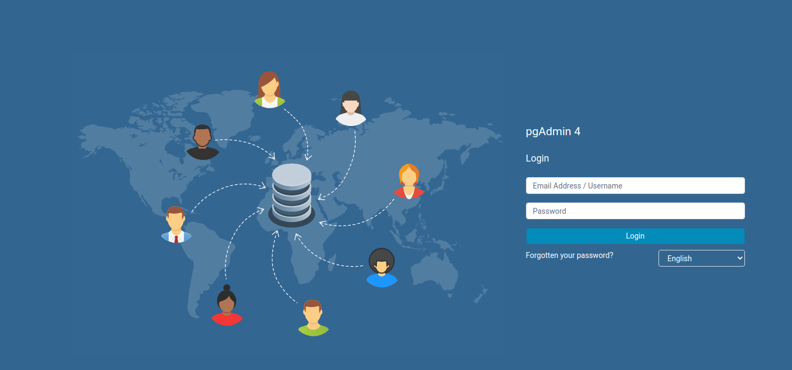
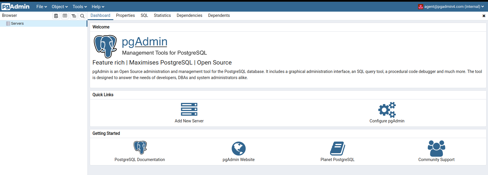
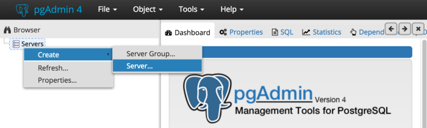
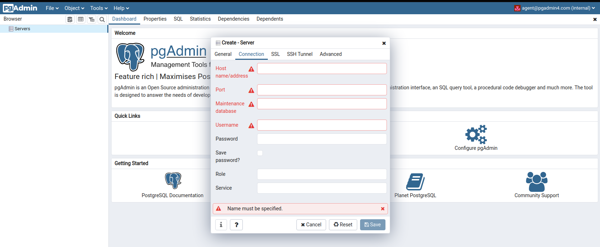
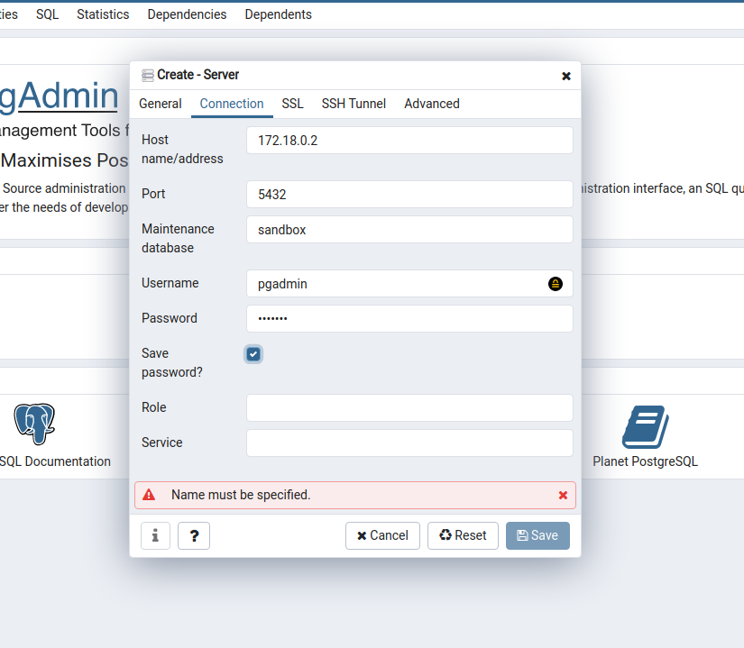
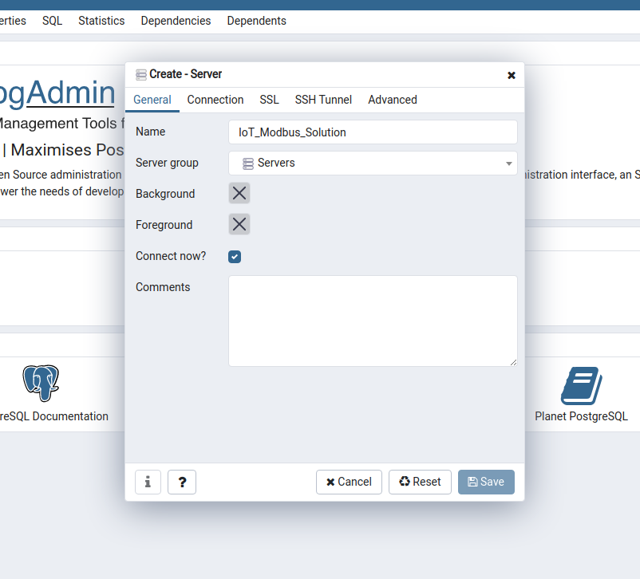
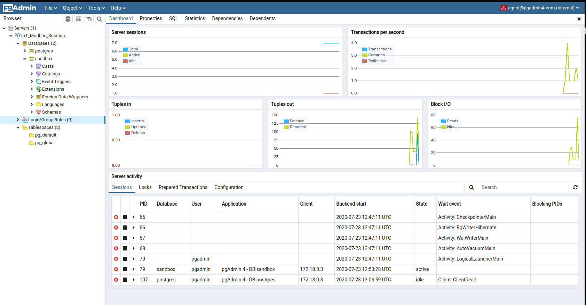

# iot-modbus-solution
Modbus based IoT Solution using Python, PostgreSQL, Docker, Express.js and React.js

## How to ...

Following steps will help you to start the application and adapt it for your own

## Index

### Clone the project

	git clone https://github.com/fcomir-io/iot-modbus-solution.git
	cd iot-modbus-solution
	git submodule update --init --recursive

### Project Structure

**TODO... Explicar el contenido de cada carpeta**

### Setup PostgresSQL Database

After cloning the project, a **docker-compose.yml** file can be found in */database* folder.

Be aware that the yml-file contains sensible data; you may want to use **environment variables** to protect them.

You need docker-compose to proceed. 
If you need to install it, check this document [Setting Up Docker-Compose](./database/DockerCompose_Setup.md) 

#### Start Docker-Compose

Run the docker-compose file in detached mode, and thus receive the bash back, issue the command:

	docker-compose up -d

Now our services **postgres** and **pgadmin** are running.

To check if the services are running, execute command '*docker ps*'

	>> docker ps 
	CONTAINER ID        IMAGE               COMMAND                  CREATED             STATUS              PORTS                           NAMES
	3c934a6efc4e        postgres            "docker-entrypoint.s…"   7 minutes ago       Up 7 minutes        0.0.0.0:5432->5432/tcp          postgres_container
	63bc94905c29        dpage/pgadmin4      "/entrypoint.sh"         7 minutes ago       Up 7 minutes        443/tcp, 0.0.0.0:5050->80/tcp   pgadmin_container

	>> docker-compose ps
	       Name                     Command              State               Ports
	------------------------------------------------------------------------------------------
	pgadmin_container    /entrypoint.sh                  Up      443/tcp, 0.0.0.0:5050->80/tcp
	postgres_container   docker-entrypoint.sh postgres   Up      0.0.0.0:5432->5432/tcp

There are two ways of accessing the postgres container

1- From the terminal

**TODO**

2- Using the pgadmin service ==> go to **localhost:5050**

Userrname and password were defined in the **docker-compose.yml**

	PGADMIN_DEFAULT_EMAIL: ${PGADMIN_EMAIL:-agent@pgadmin4.com}
	PGADMIN_DEFAULT_PASSWORD: ${PGADMIN_PASSWORD:-pgadmin4}

After login we get into a nice UI where we can access and modify our database running runnning on a docker container

For that we need to connect the pgadmin to the postgres database. To do that we need to create a server:

 
 

All information required is obtained from the docker-compose.yml. 
The host is the information we don't have yet.

To get that information we have to check the networks built by the docker-compose process.
Execute command '*docker network ls*' to list them:

	>> docker network ls
	NETWORK ID          NAME                    DRIVER              SCOPE
	4430cd67d4f4        bridge                  bridge              local
	0adc24af718e        database_postgres_net   bridge              local
	24f68454b50c        host                    host                local
	b85d72a79378        none                    null                local
	
The network we want to inspect is the *database_postgres_net* since it is the one created in our docker-compose file as a bridge between the two containers.

	docker network inspect database_postgres_net
	[
	    {
	        "Name": "database_postgres_net",
	        "Id": "0adc24af718eb75bc10e90e07da3cfb1fbaf3ee9801990942b0630bad85077c7",
	        "Created": "2020-07-23T12:25:54.790083313+02:00",
	        "Scope": "local",
	        "Driver": "bridge",
	        "EnableIPv6": false,
	        "IPAM": {
	            "Driver": "default",
	            "Options": null,
	            "Config": [
	                {
	                    "Subnet": "172.18.0.0/16",
	                    "Gateway": "172.18.0.1"
	                }
	            ]
	        },
	        "Internal": false,
	        "Attachable": true,
	        "Ingress": false,
	        "ConfigFrom": {
	            "Network": ""
	        },
	        "ConfigOnly": false,
	        "Containers": {
	            "3c934a6efc4ed94161d9cfd670dfea1130716818bc7f5d7138cc5106c0a3cdb4": {
	                "Name": "postgres_container",
	                "EndpointID": "486b170353e07b62e790ff9a260d99e9bb1055ad8f02ed86c0c67d8878788ae7",
	                "MacAddress": "02:42:ac:12:00:02",
	                "IPv4Address": "172.18.0.2/16",
	                "IPv6Address": ""
	            },
	            "63bc94905c29eb845cd89586eef375191732c658091c0bc1eadb9795b77adcce": {
	                "Name": "pgadmin_container",
	                "EndpointID": "449ed92d3021a3dd742ebc2d294ef99f0531bb2c846874f56a7482f5fd618474",
	                "MacAddress": "02:42:ac:12:00:03",
	                "IPv4Address": "172.18.0.3/16",
	                "IPv6Address": ""
	            }
	        },
	        "Options": {},
	        "Labels": {
	            "com.docker.compose.network": "postgres_net",
	            "com.docker.compose.project": "database",
	            "com.docker.compose.version": "1.26.0"
	        }
	    }
	]

From this output we get that the **postgres container** is found (in this case) on the address *172.18.0.2*.
Now we have the information we were missing!

 
 

Finally the pgAdmin UI is connected to the postgres-DB

 
References:
- [Set up a PostgreSQL server and pgAdmin with Docker](https://linuxhint.com/postgresql_docker/) 

**TODO: How to do this automatically ?!?!**

### Setup project's content

The folder **__content** shall contain specific project's information, relevant for the setup of the database.

1. **database.ini** file

This file contains the information of the database we want to connect to

	[mysql]
	host = localhost
	database = ydb
	user = user7
	password = s$cret

	[postgresql]
	host=172.18.0.2
	database=sandbox
	user=pgadmin
	password=pgadmin

In our case, the information regarding **postgresql** is the relevant one.

2. **database.structure.json** file

This file contains the information needed by the script to set up the tables in the connected data base

	{
		"tables": [
		{
			"name": "data",
			"sql_command": "CREATE TABLE data (entry_id SERIAL PRIMARY KEY, timestamp TIMESTAMP NOT NULL, value REAL NOT NULL, device_id INTEGER NOT NULL, FOREIGN KEY (device_id) REFERENCES devices (device_id) ON UPDATE CASCADE ON DELETE CASCADE, signal_id INTEGER NOT NULL, FOREIGN KEY (signal_id) REFERENCES signals (signal_id) ON UPDATE CASCADE ON DELETE CASCADE )",
			"columns": ["entry_id", "timestamp", "value", "device_id", "signal_id"]
		},
		
		....
	}

With these two files, the python script will connect to the database and create (if they don't already exist) the tables needed by the application.

### Starting the application

Once the docker-compose is running, we would have the database up.
Now we need to start the whole chain of elements in our system

**1. Start Backend**

The backend consists of an Express.js application that connects to the database and provides a set of REST API functions to interact with it from the frontend part of the system.

For more information of the Backend, go to XYZ

	cd backend
	node server.js
	
If everything is ok, you should see this in the terminal

TODO

To double check, you can go to localhost:3000 and see this

TODO

**2. Start Frontend**

The frontend consists of a React.js solution meant to interact in an easy way with the database.

For more information of the Backend, go to XYZ

	cd..
	cd frontend
	npm start

If everything is ok, go to localhost:8000 and see this

TODO

**3. Start Python-Script**

The python-script is responsible of listening the Modbus communication channel and send the data to the database.

For more information of the Backend, go to XYZ

	cd ..
	python dataAdquisition.py
	
From this point all data sent over Modbus by the IoT-Devices, the python stage of the solution will extract the data and send it to the database.

**How does the script know which data to extract from the bus?**
- File *__content/modbusDeviceList.json* describes the devices in the bus and its data addresses.
 

**TODO**
All this shall be done automatically after the server starts.
This is a pending task!
